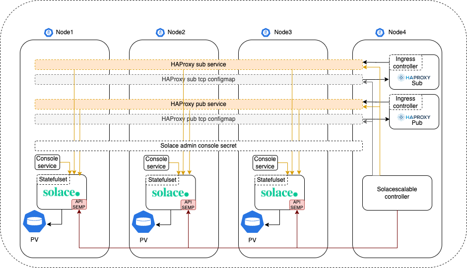
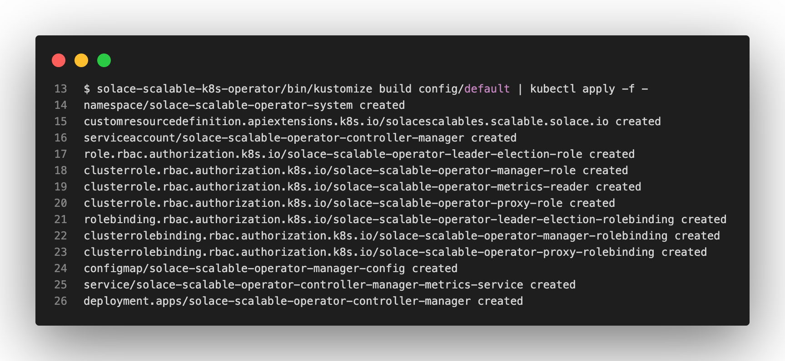
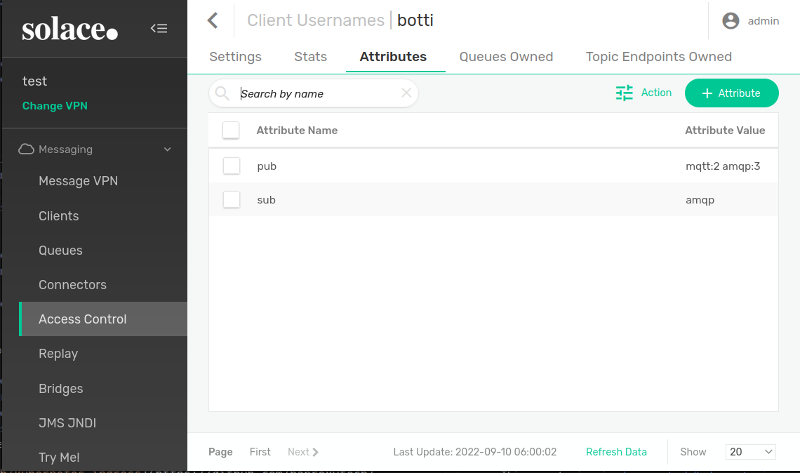

# solace-scalable-operator
A solace operator to create a scalable solace cluster under kubernetes

## Architecture


## Description
The operator is used to spawn solace standalone instances using a statefulset.
It listens to changes in the solace instances via it's SEMP api to make necessary openings in kubernetes.

In order to make openings, it will check for :
- Enabled message-vpn
- non null protocol ports opened in every message-vpn service
- Enabled client usernames (#client-username is ignored)
- Attributes defined in each client username (precisely, pub and sub attributes)

The operator will automatically listens for created, updated or deleted :
- message vpns
- client usernames
- clientusername attributes

The operator will create/update or delete :
- ClusterIP services
- Haproxypub and haproxysub services
- Haproxypub and haproxysub tcp configmaps

**NOTE**: You have to make the same provisioning in all your solace instances in order for this operator to work

## Getting Started
You’ll need a Kubernetes cluster to run against. You can use [KIND](https://sigs.k8s.io/kind) to get a local cluster for testing, or run against a remote cluster.

**Note:** Your controller will automatically use the current context in your kubeconfig file (i.e. whatever cluster `kubectl cluster-info` shows).
### Prerequisists
This operator is using [haproxytech/kubernetes-ingress](https://github.com/haproxytech/kubernetes-ingress)

Add the haproxytech/kubernetes-ingress helm repo
```sh
helm repo add haproxytech https://haproxytech.github.io/helm-charts
helm repo update
```

You need to install 2 HAproxy instances:
- One for publishing
- One for subscribing.


Use below 2 helm charts with the following options
#### Pub Haproxy ingress for publishing
```sh
helm install --namespace ingress-controller --create-namespace --set controller.ingressClass='haproxy-pub',controller.ingressClassResource.name='haproxy-pub',controller.replicaCount=1,controller.extraArgs={'--configmap-tcp-services=solacescalable/solacescalable-pub-tcp-ingress'} haproxy-pub haproxytech/kubernetes-ingress
```
#### Sub Haproxy ingress for subscribing
```sh
helm install --namespace ingress-controller --create-namespace --set controller.ingressClass='haproxy-sub',controller.ingressClassResource.name='haproxy-sub',controller.replicaCount=1,controller.extraArgs={'--configmap-tcp-services=solacescalable/solacescalable-sub-tcp-ingress'} haproxy-sub haproxytech/kubernetes-ingress
```
#### Create solacescalable namespace
```sh
kubectl create ns solacescalable
```
#### solace admin password
```
kubectl create secret -n solacescalable generic solacescalable --from-literal adminPassword=<your password>
```
**NOTE**: If you run it like above, don't forget to clean your shell history

#### Deploy the operator
```sh
make deploy IMG=benmstm/solace-scalable-k8s-operator:latest
```
**Note**: Below is the list of resources created in the cluster


### Running on the cluster
Install an Instance of the Custom Resource:
```
kubectl apply -f config/samples/scalable_v1alpha1_solacescalable.yaml
```
**NOTE**: The Instance consist of the following yaml
```yaml
apiVersion: scalable.solace.io/v1alpha1
kind: SolaceScalable
metadata:
  name: solacescalable
  namespace: solacescalable
spec:
  replicas: 3
  # Optional field can be omitted
  clusterUrl: scalable.dev.gcp.digital-backbone.io
  container:
    name: solace
    image: solace/solace-pubsub-standard:latest
    volume:
      name: storage
      size: 50Gi
      hostPath: /opt/storage
    env:
    - name: username_admin_globalaccesslevel
      value: admin
    - name: username_admin_password
      valueFrom:
        secretKeyRef:
          name: solacescalable
          key: adminPassword
          optional: false
  # when localManual, it will create a host path voulme in the cluster
  # you can change this behaviour by selecying another pvClass 
  pvClass: localManual
  haproxy:
    namespace: ingress-controller
    publish:
      serviceName: haproxy-pub-kubernetes-ingress
    subscribe:
      serviceName: haproxy-sub-kubernetes-ingress
  # Optional field can be omitted (default port allocation start at 1024)
  network:
    startingAvailablePorts: 1025
```
**Thats all folks :)**
## Build your own image
Build and push your image to the location specified by `IMG`:
	
```sh
make docker-build docker-push IMG=repo/img_name:tag
```
	
Deploy the controller to the cluster with the image specified by `IMG`:

```sh
make deploy IMG=repo/img_name:tag
```

## Uninstall CRDs
To delete the CRDs from the cluster:

```sh
make uninstall
```

### Undeploy controller
remove the controller from the cluster:

```sh
make undeploy
```

## Solace side configuration (Optional)
We are using solace's client username attributes at our favour to store operator's behavioural datas
```
Select Message-Vpn -> Access control -> Client Usernames -> Select A client -> Attributes
```


**NOTE**: There is the case were the client having 1 clientUsername want to publish in different topics and want the connection to be split evenly across the cluster.
In this case we added a simple mecanism to spawn n ports for the same couple (clientusername/protocol), after each protocol name just add **:n** as mentioned in the image above.

### Attribute Names
- pub: if we want the clientusername have openings in the publish haproxy ingress
- sub: if we want the openings in subscribe haproxy
### What happens in HAProxy conf and k8s SVCs ?

 

**NOTE:** If no pub/sub attribute are present in the clientusername, then all ports for all active protocols in the message VPN are exposed for pub/sub
In the above example we will have the following openings:

|Client Username|  Protocol     | pub or sub| number of ports to open|
|---            |:---:          |      :---:|:---:                   |
|**botti**      |  **mqtt**     |    pub    |           2            |
|**botti**      |  **amqp**     |    pub    |           3            |
|**botti**      |  **amqp**     |    sub    |           1            |

### Attribute Values
Must be a list of string separated by a space.
Here is the complete supported protocol list

|Solace correspondance  	             |  Protocol     |
|---                                     |:---:          |
|ServiceAmqpPlainTextListenPort          |  **amqp**     |
|ServiceAmqpTlsListenPort                |  **amqps**    |
|ServiceMqttPlainTextListenPort          |  **mqtt**     |
|ServiceMqttTlsListenPort                |  **mqtts**    |
|ServiceMqttTlsWebSocketListenPort       |  **mqttws**   |
|ServiceRestIncomingPlainTextListenPort  |  **rest**     |
|ServiceRestIncomingTlsListenPort        |  **rests**    |

## Optional kubectl-plugin
In order to get the created pub/sub service ports in a clear manner, you can use the following [kubectl ports](https://github.com/benm-stm/kubectl-ports)

## Useful links
- [Contribute](https://github.com/benm-stm/solace-scalable-k8s-operator/blob/main/CONTRIBUTE.MD)
- [Licence](https://github.com/benm-stm/solace-scalable-k8s-operator/blob/main/LICENCE.MD)
