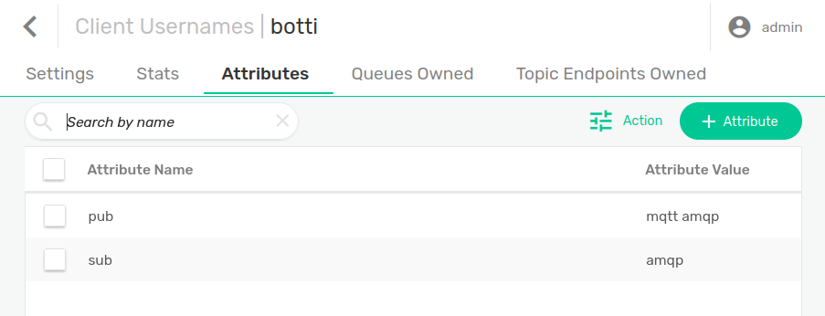

# solace-scalable-operator
A solace operator to create a scalable solace cluster under kubernetes

## Description
The operator is used to spawn solace standalone instances using a statefulset,
it listens to changes in the instances (added services, message-vpns, client-usernames and ports)to update resources in kubernetes.

It will automatically listens for newly opened ports and update the services and haproxy tcp connections.

PS: you have to make the same provisioning in all your solace instances in order for this operator to work

## Getting Started
You’ll need a Kubernetes cluster to run against. You can use [KIND](https://sigs.k8s.io/kind) to get a local cluster for testing, or run against a remote cluster.
**Note:** Your controller will automatically use the current context in your kubeconfig file (i.e. whatever cluster `kubectl cluster-info` shows).
### Prerequisists
This operator is using [haproxytech/kubernetes-ingress](https://github.com/haproxytech/kubernetes-ingress)

You need to install 2 HAproxy instances, 1 for publishing and the other for subscribing.

Use below 2 helm charts with the following changes
#### Pub Haproxy ingress for publishing
```
helm install --namespace ingress-controller --create-namespace --set controller.ingressClass='haproxy-pub',controller.ingressClassResource.name='haproxy-pub',controller.replicaCount=1,controller.extraArgs={'--configmap-tcp-services=solacescalable/solacescalable-pub-tcp-ingress'} haproxy-pub haproxytech/kubernetes-ingress
```
#### Sub Haproxy ingress for subscribing
```
helm install --namespace ingress-controller --create-namespace --set controller.ingressClass='haproxy-sub',controller.ingressClassResource.name='haproxy-sub',controller.replicaCount=1,controller.extraArgs={'--configmap-tcp-services=solacescalable/solacescalable-sub-tcp-ingress'} haproxy-sub haproxytech/kubernetes-ingress
```

#### solace admin password
```
kubectl create secret -n solacescalable generic solacescalable --from-literal adminPassword=<your password>
```
**NOTE**: If you run it like above, don't forget to clean your shell history
### Running on the cluster
1. Install Instances of Custom Resources:

```sh
kubectl apply -f config/samples/
```

2. Build and push your image to the location specified by `IMG`:
	
```sh
make docker-build docker-push IMG=benmstm/solace-scalable-operator:tag
```
	
3. Deploy the controller to the cluster with the image specified by `IMG`:

```sh
make deploy IMG=benmstm/solace-scalable-operator:tag
```

### Uninstall CRDs
To delete the CRDs from the cluster:

```sh
make uninstall
```

### Undeploy controller
UnDeploy the controller to the cluster:

```sh
make undeploy
```

### Solace side configuration
A new feature is added in version 2 which consists of using clientUsername attributes to make the necessary openings in kubernetes (Solace Services,Haproxy services (pub and sub) and tcp-configmap)




#### Attributes Name
Can be either :
- pub
- sub

**NOTE:** If no pub/sub attribute are present in the clientusername, then all ports for all active protocols in the message VPN are exposed for pub/sub

#### Attributes Values
Must be a list of string separated by a space.
Here is the complete supported protocol list

|Solace correspondance  	             |  Protocol     |
|---                                     |:---:          |
|ServiceAmqpPlainTextListenPort          |  **amqp**     |
|ServiceAmqpTlsListenPort                |  **amqps**    |
|ServiceMqttPlainTextListenPort          |  **mqtt**     |
|ServiceMqttTlsListenPort                |  **mqtts**    |
|ServiceMqttTlsWebSocketListenPort       |  **mqttws**   |
|ServiceRestIncomingPlainTextListenPort  |  **rest**     |
|ServiceRestIncomingTlsListenPort        |  **rests**    |

## Contributing
in order to contribute you open a pull request and we will discuss it :)

### How it works
This project aims to follow the Kubernetes [Operator pattern](https://kubernetes.io/docs/concepts/extend-kubernetes/operator/)

It uses [Controllers](https://kubernetes.io/docs/concepts/architecture/controller/) 
which provides a reconcile function responsible for synchronizing resources untile the desired state is reached on the cluster 

### Test It Out
1. Install the CRDs into the cluster:

```sh
make install
```

2. Run your controller (this will run in the foreground, so switch to a new terminal if you want to leave it running):

```sh
make run
```

**NOTE:** You can also run this in one step by running: `make install run`

### Modifying the API definitions
If you are editing the API definitions, generate the manifests such as CRs or CRDs using:

```sh
make manifests
```

**NOTE:** Run `make --help` for more information on all potential `make` targets

More information can be found via the [Kubebuilder Documentation](https://book.kubebuilder.io/introduction.html)

## Optional kubectl-plugin
In order to get the created pub/sub service ports in a clear manner, you can use the following kubectl [ports](https://github.com/benm-stm/kubectl-ports) 
## License

Copyright 2022.

Licensed under the Apache License, Version 2.0 (the "License");
you may not use this file except in compliance with the License.
You may obtain a copy of the License at

    http://www.apache.org/licenses/LICENSE-2.0

Unless required by applicable law or agreed to in writing, software
distributed under the License is distributed on an "AS IS" BASIS,
WITHOUT WARRANTIES OR CONDITIONS OF ANY KIND, either express or implied.
See the License for the specific language governing permissions and
limitations under the License.
